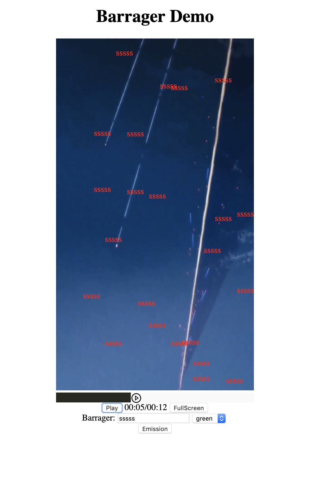

# Bullet Screen
Video Player with Bullet Screen
## Introduction
* Use video.currentTime to identify the current time.   
* The barrage object has text, color and time to make sure where and what the bullet should be.
* Use Barragers to hold all barrages . 

***(All the word 'barrage' or 'barrager' in this readme is the same mean as bullet screen)***

## [Demo](https://www1.coe.neu.edu/~wukaichun/video/video.html)

